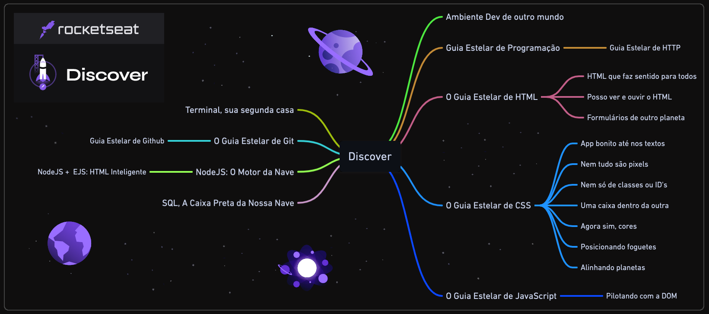

# Rocketseat - Discover

## Tecnologias Estudadas

 
  
  
  
  
  
  
  
  <!--
  <strong height="50" width="60">&nbsp; SQL &nbsp;</strong>
  -->

  

## Anotações

 
  📙 <a href="/HTML/html.md"><strong>HTML</strong></a>&nbsp;&nbsp; | &nbsp;&nbsp;
  📘 <a href="/CSS/css.md"><strong>CSS</strong></a>&nbsp;&nbsp; | &nbsp;&nbsp;
  📒 <a href="/JavaScript/javascript.md"><strong>JavaScript</strong></a>&nbsp;&nbsp; | &nbsp;&nbsp;
  🕓 <a href="/Git/git.md"><strong>Git</strong></a>&nbsp;&nbsp; | &nbsp;&nbsp;
  💻 <a href="/node/node.md"><strong>NodeJS</strong></a>&nbsp;&nbsp; | &nbsp;&nbsp;
  📄 <a href="/node_EJS/EJS.md"><strong>EJS</strong></a>
  <!--
  &nbsp;&nbsp; | &nbsp;&nbsp;
  💾 <a href="/SQL/sql.md"><strong>SQL</strong></a>
  -->

## Módulos

<!-- ❌✅ -->

### 🚀 **Equipando sua nave**

1. ❌ Ambiente dev de outro mundo
1. ✔️ Terminal, sua segunda casa

#

### 📚 **Guias estelares**

1. ✔️ Guia Estelar de Programação
1. ✔️ Guia Estelar de HTTP
1. ✔️ O Guia Estelar de HTML
1. ✔️ O Guia Estelar de CSS
1. ✔️ O Guia Estelar de JavaScript
1. ✔️ Guia Estelar de Git
1. ✔️ Guia Estelar de Github

#

### 👨🏽‍🚀 **Preparação de astronautas**

1. ✔️ (HTML) Formulários de outro planeta
1. ✔️ (HTML) HTML que faz sentido, para todos
1. ✔️ (HTML) Posso ver e ouvir o HTML
1. ✔️ (JS) Pilotando com a DOM
1. ✔️ (CSS) App bonito, até nos textos
1. ✔️ (CSS) Nem tudo são pixels
1. ✔️ (CSS) Nem só de classes ou ID's
1. ✔️ (CSS) Uma caixa dentro da outra
1. ✔️ (CSS) Agora sim, cores
1. ✔️ (CSS) Posicionando foguetes
1. ✔️ (CSS) Alinhando os planetas

#

### 🛰️ **Viajando ao espaço**

1. ✔️ NodeJS: O Motor da Nave
1. ✔️ NodeJS + EJS: HTML Inteligente
1. ❌ SQL, a caixa preta da nossa nave

#

## Trilhas

<!-- ❌✅ -->

### 🌎 Conectar

1. ✔️ Guia Estelar de Programação
1. ❌ Computador, Software e Hardware ✨
1. ❌ Internet, Roteadores e Servidores ✨
1. ❌ Sistemas Operacionais ✨
1. ❌ Tipos de Aplicações WEB ✨
1. ❌ Linguagem de Programação ✨
1. ❌ Ambiente Dev

#

### 🪐 Fundamentar

1. ✔️ Guia Estelar de HTML
2. ✔️ Guia Estelar de CSS
3. ✔️ Nem tudo são pixels
4. ✔️ Uma caixa dentro da outra
5. ✔️ Agora sim, cores
6. ✔️ Posso ver e ouvir o HTML
7. ✔️ Posicionando foguetes
8. ✔️ App bonito, até nos textos
9. ✔️ Formulários de outro planeta
10. ✔️ Guia Estelar JavaScript
11. ✔️ HTML que faz sentido, para todos
12. ✔️ Nem só de classes ou ID's
13. ✔️ Alinhando os planetas
14. ✔️ Pilotando com a DOM
15. ✔️ Terminal
16. ✔️ NodeJS
17. ✔️ Node + EJS
18. ❌ SQL
19. ❌ Estruturas de Dados  ✨
20. ❌ Programação Orientada a Objetos ✨
21. ❌ Programação Funcional ✨
22. ✔️ Guia Estelar de Git
23. ✔️ Guia estelar de Github
24. ✔️ Guia Estelar de HTTP
25. ❌ Maratona 01
